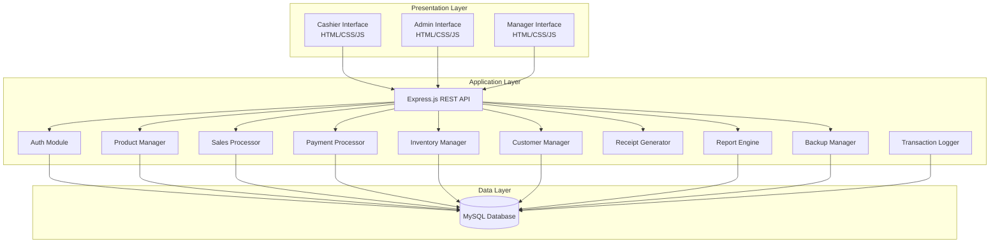
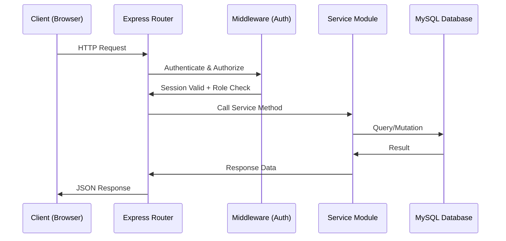
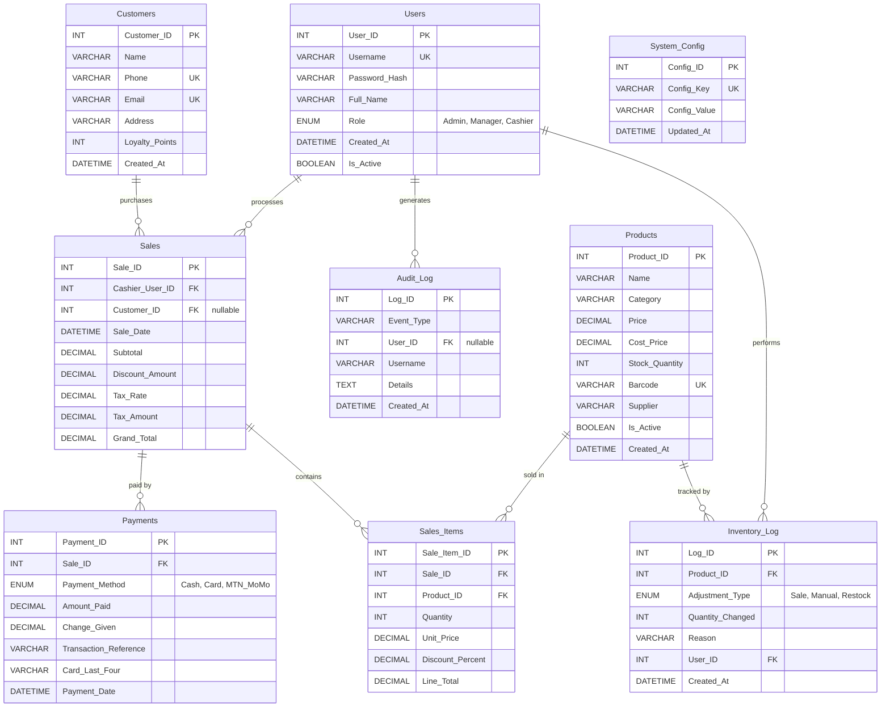

# Design Document: POS System

## Overview

The POS System is a web-based Point of Sale application built on a three-tier architecture. It enables retail businesses to process sales, manage inventory, handle multiple payment methods, track customers with loyalty programs, and generate business reports.

### Technology Stack

- **Frontend**: HTML, CSS, JavaScript (vanilla)
- **Backend**: Node.js with Express.js
- **Database**: MySQL (relational, well-suited for transactional POS data with foreign key constraints)
- **Authentication**: bcrypt for password hashing, express-session for session management
- **Testing**: Mocha + Chai for unit tests, fast-check for property-based tests
- **Export**: json2csv for CSV generation, pdfkit for PDF receipt generation

### Design Rationale

MySQL was chosen over MongoDB because the POS system has highly relational data (sales → sale_items → products, payments → sales, etc.) with strict referential integrity requirements (Requirement 27.8). A relational database with foreign key constraints naturally enforces these relationships. Express.js provides a minimal, well-understood HTTP framework for the REST API layer. Vanilla JavaScript on the frontend keeps the stack simple and educational.

## Architecture

The system follows a three-tier architecture:



### Request Flow




## Components and Interfaces

### 1. Auth Module (`/src/modules/auth/`)

Handles user authentication, session management, and role-based access control.

**API Endpoints:**
| Method | Endpoint | Description | Roles |
|--------|----------|-------------|-------|
| POST | `/api/auth/login` | Authenticate user | Public |
| POST | `/api/auth/logout` | Terminate session | All |
| GET | `/api/auth/session` | Get current session info | All |
| POST | `/api/users` | Create user account | Admin |
| PUT | `/api/users/:id` | Update user account/role | Admin |
| GET | `/api/users` | List all users | Admin |

**Key Functions:**
- `authenticate(username, password)` → `{ success, user, sessionToken }` or `{ success: false, error }`
- `authorize(sessionToken, requiredRole)` → `boolean`
- `hashPassword(plaintext)` → `string` (bcrypt hash)
- `createSession(userId)` → `sessionToken`
- `destroySession(sessionToken)` → `void`

**Middleware:**
- `requireAuth` — validates session exists and is not expired (15-min idle timeout)
- `requireRole(role)` — checks user role meets minimum permission level (Cashier < Manager < Admin)

### 2. Product Manager (`/src/modules/product/`)

CRUD operations for the product catalog.

**API Endpoints:**
| Method | Endpoint | Description | Roles |
|--------|----------|-------------|-------|
| GET | `/api/products` | List/search products | All |
| GET | `/api/products/:id` | Get product by ID | All |
| GET | `/api/products/barcode/:code` | Lookup by barcode | All |
| POST | `/api/products` | Create product | Manager, Admin |
| PUT | `/api/products/:id` | Update product | Manager, Admin |
| DELETE | `/api/products/:id` | Soft-delete product | Manager, Admin |

**Key Functions:**
- `createProduct(data)` → `Product` — auto-generates Product_ID, validates name non-empty, price > 0, barcode unique
- `updateProduct(id, data)` → `Product`
- `deactivateProduct(id)` → `void` — sets Is_Active = false
- `searchProducts(query)` → `Product[]` — searches by name or category
- `lookupBarcode(barcode)` → `Product | null`

### 3. Sales Processor (`/src/modules/sales/`)

Manages shopping cart state and sale transaction creation.

**API Endpoints:**
| Method | Endpoint | Description | Roles |
|--------|----------|-------------|-------|
| POST | `/api/cart/items` | Add item to cart | Cashier, Manager |
| PUT | `/api/cart/items/:productId` | Update item quantity | Cashier, Manager |
| DELETE | `/api/cart/items/:productId` | Remove item from cart | Cashier, Manager |
| DELETE | `/api/cart` | Clear cart | Cashier, Manager |
| POST | `/api/cart/discount` | Apply discount | Cashier, Manager |
| POST | `/api/sales/checkout` | Complete sale | Cashier, Manager |
| GET | `/api/sales/:id` | Get sale details | All |

**Key Functions:**
- `addToCart(cart, productId, quantity)` → `Cart` — validates stock availability
- `updateCartItemQuantity(cart, productId, quantity)` → `Cart`
- `removeFromCart(cart, productId)` → `Cart`
- `clearCart()` → `Cart`
- `applyItemDiscount(cart, productId, percent)` → `Cart` — clamps so line total ≥ 0
- `applySaleDiscount(cart, fixedAmount)` → `Cart` — clamps so grand total ≥ 0
- `calculateTotals(cart, taxRate)` → `{ subtotal, discountAmount, taxAmount, grandTotal }`
- `checkout(cart, payments, cashierUserId, customerId?)` → `SaleTransaction`

### 4. Payment Processor (`/src/modules/payment/`)

Handles payment recording for cash, card, MTN Mobile Money (via MTN MoMo API), and split payments.

**API Endpoints:**
| Method | Endpoint | Description | Roles |
|--------|----------|-------------|-------|
| POST | `/api/payments` | Record payment | Cashier, Manager |
| GET | `/api/payments/sale/:saleId` | Get payments for sale | All |

**Key Functions:**
- `processCashPayment(saleId, amountTendered, grandTotal)` → `{ payment, changeDue }` — rejects if tendered < total
- `processMTNMoMoPayment(saleId, amount, momoTransactionRef)` → `Payment` — integrates with MTN MoMo API to verify transaction
- `processCardPayment(saleId, amount, cardType, lastFour)` → `Payment`
- `processSplitPayment(saleId, paymentEntries[], grandTotal)` → `{ payments[], changeDue }` — validates combined ≥ total

### 5. Inventory Manager (`/src/modules/inventory/`)

Tracks stock levels, handles adjustments, and generates low-stock alerts.

**API Endpoints:**
| Method | Endpoint | Description | Roles |
|--------|----------|-------------|-------|
| POST | `/api/inventory/adjust` | Manual stock adjustment | Manager, Admin |
| GET | `/api/inventory/alerts` | Get low-stock alerts | Manager, Admin |
| PUT | `/api/products/:id/threshold` | Set low-stock threshold | Manager, Admin |

**Key Functions:**
- `deductStock(productId, quantity)` → `void` — prevents negative stock
- `adjustStock(productId, quantity, reason, userId)` → `InventoryLog`
- `checkLowStock(productId)` → `Alert | null`
- `getLowStockAlerts()` → `Alert[]`

### 6. Customer Manager (`/src/modules/customer/`)

Manages customer records and loyalty points.

**API Endpoints:**
| Method | Endpoint | Description | Roles |
|--------|----------|-------------|-------|
| POST | `/api/customers` | Create customer | Cashier, Manager, Admin |
| PUT | `/api/customers/:id` | Update customer | Manager, Admin |
| GET | `/api/customers` | Search customers | All |
| GET | `/api/customers/:id` | Get customer details | All |
| POST | `/api/customers/:id/loyalty/redeem` | Redeem loyalty points | Cashier, Manager |

**Key Functions:**
- `createCustomer(data)` → `Customer` — auto-generates Customer_ID, validates phone/email unique
- `updateCustomer(id, data)` → `Customer`
- `searchCustomers(query)` → `Customer[]` — by name or phone
- `addLoyaltyPoints(customerId, grandTotal)` → `number` — adds floor(grandTotal) points
- `redeemLoyaltyPoints(customerId, points)` → `number` — prevents over-redemption

### 7. Receipt Generator (`/src/modules/receipt/`)

Formats and outputs sale receipts.

**Key Functions:**
- `formatReceipt(saleTransaction, storeConfig)` → `string` — structured text format
- `parseReceipt(receiptText)` → `SaleTransactionData` — inverse of formatReceipt (round-trip)
- `generatePDF(receiptText)` → `Buffer` — PDF output via pdfkit

### 8. Report Engine (`/src/modules/report/`)

Generates business reports.

**API Endpoints:**
| Method | Endpoint | Description | Roles |
|--------|----------|-------------|-------|
| GET | `/api/reports/daily-sales` | Daily sales report | Manager, Admin |
| GET | `/api/reports/product-sales` | Product sales report | Manager, Admin |
| GET | `/api/reports/cashier-performance` | Cashier performance report | Manager, Admin |
| GET | `/api/reports/profit` | Profit report | Manager, Admin |
| GET | `/api/reports/inventory` | Inventory report | Manager, Admin |

**Key Functions:**
- `dailySalesReport(date | dateRange)` → `DailySalesReport`
- `productSalesReport(dateRange, category?)` → `ProductSalesReport`
- `cashierPerformanceReport(dateRange)` → `CashierPerformanceReport`
- `profitReport(dateRange)` → `ProfitReport`
- `inventoryReport(category?)` → `InventoryReport`
- `exportToCSV(reportData, columns)` → `string`

### 9. Backup Manager (`/src/modules/backup/`)

Database backup, restore, and data export.

**API Endpoints:**
| Method | Endpoint | Description | Roles |
|--------|----------|-------------|-------|
| POST | `/api/backup` | Create backup | Admin |
| POST | `/api/backup/restore` | Restore from backup | Admin |
| GET | `/api/export/:table` | Export table as CSV | Admin |

**Key Functions:**
- `createBackup(backupDir)` → `{ filePath, fileSize }` — timestamped mysqldump
- `restoreBackup(filePath)` → `void` — replaces current DB, invalidates all sessions
- `exportTable(tableName)` → `string` — CSV with headers, excludes password_hash from Users

### 10. Transaction Logger (`/src/modules/logger/`)

Append-only audit logging.

**Key Functions:**
- `logEvent(eventType, userId, details)` → `void` — inserts into audit_log table
- Event types: `LOGIN_SUCCESS`, `LOGIN_FAILURE`, `SALE_COMPLETED`, `PRODUCT_CREATED`, `PRODUCT_UPDATED`, `PRODUCT_DELETED`, `INVENTORY_ADJUSTED`, `BACKUP_CREATED`, `BACKUP_RESTORED`


## Data Models

### Database Schema (MySQL)



### Key Data Structures (JavaScript)

```javascript
// Cart (in-memory, per session)
{
  items: [
    {
      productId: Number,
      name: String,
      unitPrice: Number,
      quantity: Number,
      discountPercent: Number,  // 0-100
      lineTotal: Number         // unitPrice * quantity * (1 - discountPercent/100)
    }
  ],
  saleDiscount: Number,         // fixed amount discount on entire sale
  customerId: Number | null
}

// Sale Transaction (persisted)
{
  saleId: Number,
  cashierUserId: Number,
  customerId: Number | null,
  saleDate: Date,
  items: [{ productId, name, quantity, unitPrice, discountPercent, lineTotal }],
  subtotal: Number,
  discountAmount: Number,
  taxRate: Number,
  taxAmount: Number,
  grandTotal: Number,
  payments: [{ method, amountPaid, changeGiven, transactionRef, cardLastFour }]
}

// Low Stock Alert
{
  productId: Number,
  productName: String,
  currentStock: Number,
  threshold: Number
}
```

### Calculation Rules

1. **Line Total**: `unitPrice × quantity × (1 - discountPercent / 100)`
2. **Subtotal**: Sum of all line totals
3. **Post-Discount Subtotal**: `subtotal - saleDiscount` (clamped to ≥ 0)
4. **Tax Amount**: `postDiscountSubtotal × (taxRate / 100)`
5. **Grand Total**: `postDiscountSubtotal + taxAmount`
6. **Loyalty Points Earned**: `Math.floor(grandTotal)`
7. **Change Due (cash)**: `amountTendered - grandTotal`

All monetary values use `DECIMAL(10,2)` in MySQL and are rounded to 2 decimal places in calculations.


## Correctness Properties

*A property is a characteristic or behavior that should hold true across all valid executions of a system — essentially, a formal statement about what the system should do. Properties serve as the bridge between human-readable specifications and machine-verifiable correctness guarantees.*

### Property 1: Password hash is non-reversible and verifiable

*For any* plaintext password, hashing it should produce a value that is not equal to the plaintext, and comparing the plaintext against the hash using bcrypt.compare should return true.

**Validates: Requirements 1.4**

### Property 2: Authentication correctness

*For any* username and password pair, authentication should succeed if and only if a user record exists with that username and the password matches the stored hash. On failure, the error message should not indicate whether the username or password was incorrect.

**Validates: Requirements 1.1, 1.3**

### Property 3: Session expiry after idle timeout

*For any* user session, if the time since the last activity exceeds 15 minutes, the session should be considered invalid and any request using that session should be rejected.

**Validates: Requirements 1.7**

### Property 4: Role-based access control enforcement

*For any* user with a given role (Admin, Manager, or Cashier) and any API endpoint, access should be granted if and only if the endpoint is within the allowed set for that role. Cashiers may only access sales processing, receipt viewing, and customer lookup. Managers may additionally access inventory, customer management, and reports. Admins may access all endpoints.

**Validates: Requirements 1.5, 2.3, 2.4, 2.5**

### Property 5: User creation requires all mandatory fields

*For any* user creation request missing any of username, password, full name, or role, the creation should be rejected with a validation error.

**Validates: Requirements 2.2**

### Property 6: Product validation constraints

*For any* product creation or update, the Product Name must be non-empty and the Price must be a positive number. Any request violating these constraints should be rejected. Additionally, for any two active products, their barcodes must be distinct.

**Validates: Requirements 3.5, 3.6**

### Property 7: Product soft-delete preserves records

*For any* product that is deleted, the product record should still exist in the database with Is_Active set to false, and the product should no longer appear in active product searches.

**Validates: Requirements 3.4**

### Property 8: Product search returns only active matches

*For any* search query string, all returned products should be active (Is_Active = true) and should match the query by name or category. No inactive products should appear in results.

**Validates: Requirements 4.1**

### Property 9: Barcode lookup round-trip

*For any* active product with an assigned barcode, looking up that barcode should return that exact product. For any barcode not assigned to any active product, the lookup should return no result.

**Validates: Requirements 4.2, 4.3**

### Property 10: Cart totals calculation invariant

*For any* shopping cart state (after any sequence of add, remove, quantity change, or discount operations), the following invariants must hold:
- Each line total equals `unitPrice × quantity × (1 - discountPercent / 100)`
- Subtotal equals the sum of all line totals
- Post-discount subtotal equals `max(0, subtotal - saleDiscount)`
- Tax amount equals `postDiscountSubtotal × (taxRate / 100)`, rounded to 2 decimal places
- Grand total equals `postDiscountSubtotal + taxAmount`
- No line total or grand total is negative

**Validates: Requirements 5.2, 5.5, 6.1, 6.2, 6.3, 7.1**

### Property 11: Cart item removal decreases count

*For any* non-empty shopping cart, removing an item should decrease the item count by exactly one and the subtotal should equal the sum of the remaining items' line totals.

**Validates: Requirements 5.3**

### Property 12: Cart clear resets to empty state

*For any* shopping cart, clearing it should result in zero items and all totals (subtotal, discount, tax, grand total) equal to zero.

**Validates: Requirements 5.6**

### Property 13: Stock quantity prevents over-selling

*For any* product with stock quantity S, attempting to add a quantity Q > S to the cart should be rejected. The cart should remain unchanged.

**Validates: Requirements 5.4, 12.4**

### Property 14: Sale transaction completeness

*For any* completed checkout, the resulting Sale_Transaction record should contain a unique Sale ID, a valid timestamp, the cashier's user ID, the complete list of items with quantities and prices, the discount amount, the tax rate and tax amount, and the grand total. The stored tax rate should match the system configuration at the time of the sale.

**Validates: Requirements 8.1, 8.5, 7.4**

### Property 15: Sale completion deducts inventory

*For any* completed sale containing items, the stock quantity of each product should decrease by exactly the quantity sold in that transaction, and the deduction should be atomic with the sale record persistence.

**Validates: Requirements 8.3, 12.2**

### Property 16: Cash payment change calculation

*For any* cash payment where the amount tendered is greater than or equal to the grand total, the change due should equal `amountTendered - grandTotal`. For any amount tendered less than the grand total, the payment should be rejected.

**Validates: Requirements 9.1, 9.2**

### Property 17: Non-cash payment recording

*For any* MTN Mobile Money payment, the stored record should contain the payment method "MTN_MoMo", the MTN MoMo transaction reference, and the amount paid. For any card payment, the stored record should contain the payment method "Card", the card type, the last four digits, and the amount paid.

**Validates: Requirements 10.1, 10.2, 10.3**

### Property 18: Split payment balance invariant

*For any* split payment sequence against a grand total G, after recording partial payments P1, P2, ..., Pn, the remaining balance should equal `max(0, G - sum(P1..Pn))`. When the sum of all partial payments equals or exceeds G, the transaction should complete with change equal to `sum(P1..Pn) - G`. Each partial payment should be stored as a separate record linked to the same Sale_Transaction.

**Validates: Requirements 11.1, 11.2, 11.3, 11.4**

### Property 19: Inventory adjustment logging

*For any* manual stock adjustment, the product's stock quantity should change by the adjustment amount, and an Inventory_Log entry should be created containing the product ID, adjustment quantity, reason, and the user who performed it.

**Validates: Requirements 12.3**

### Property 20: Low-stock alert generation

*For any* product where the current stock quantity is at or below the configured threshold, a low-stock alert should exist containing the product name, current stock quantity, and threshold value. Products with stock above the threshold should not have alerts.

**Validates: Requirements 13.1, 13.2, 13.3**

### Property 21: Loyalty points calculation

*For any* completed Sale_Transaction linked to a customer with grand total G, the customer's loyalty points should increase by exactly `Math.floor(G)`.

**Validates: Requirements 16.1**

### Property 22: Loyalty points redemption

*For any* loyalty point redemption of R points from a customer with balance B, if R ≤ B the redemption should succeed and the new balance should be B - R. If R > B, the redemption should be rejected and the balance should remain B.

**Validates: Requirements 16.2, 16.3**

### Property 23: Customer uniqueness constraints

*For any* two customer records, their Phone values must be distinct and their Email values must be distinct. Creating a customer with a duplicate phone or email should be rejected.

**Validates: Requirements 15.5**

### Property 24: Receipt formatting round-trip

*For any* valid Sale_Transaction, formatting it into receipt text and then parsing that text back should produce a data structure equivalent to the original Sale_Transaction data (same items, quantities, prices, totals, payment info).

**Validates: Requirements 18.1, 18.2, 18.3**

### Property 25: Receipt contains all required fields

*For any* completed Sale_Transaction, the generated receipt text should contain: store name, store address, date and time, Sale ID, cashier name, each item with name/quantity/unit price/line total, subtotal, discount amount, tax amount, grand total, payment method, and amount tendered with change for cash payments.

**Validates: Requirements 17.1**

### Property 26: Daily sales report aggregation correctness

*For any* set of Sale_Transactions on a given date, the daily sales report should correctly compute: total transaction count, total revenue (sum of grand totals), total tax collected (sum of tax amounts), total discounts applied (sum of discount amounts), and payment method breakdown (sum of amounts per method).

**Validates: Requirements 19.1, 19.2**

### Property 27: Product sales report sorting and aggregation

*For any* set of Sale_Transactions in a date range, the product sales report should list each sold product with correct total quantity and total revenue, sorted by quantity in descending order. When filtered by category, only products in that category should appear.

**Validates: Requirements 20.1, 20.2**

### Property 28: Cashier performance report correctness

*For any* set of Sale_Transactions in a date range, the cashier performance report should list each cashier with correct transaction count, total revenue, and average transaction value (total revenue / transaction count).

**Validates: Requirements 21.1**

### Property 29: Profit report correctness

*For any* set of Sale_Transactions in a date range, the profit report should calculate total revenue as the sum of grand totals, total cost as the sum of (cost_price × quantity) for each sold item, and gross profit as revenue minus cost. The sum of per-category profits should equal the total gross profit.

**Validates: Requirements 22.1, 22.2**

### Property 30: CSV export round-trip

*For any* report data, exporting to CSV should produce a valid CSV string where the first row contains column headers and subsequent rows contain the data. Parsing the CSV back should recover all original data values.

**Validates: Requirements 14.3, 19.3, 20.3, 21.2, 22.3, 25.1, 25.3**

### Property 31: Data export excludes sensitive fields

*For any* Users table export, the resulting CSV should contain all user fields except Password_Hash. No row should contain a bcrypt hash string.

**Validates: Requirements 25.2**

### Property 32: Audit log completeness

*For any* significant system action (login attempt, sale completion, product CRUD, inventory adjustment), an audit log entry should exist with a timestamp, the acting user's ID (or username for login), and action-specific details. The audit log table should be append-only — no UPDATE or DELETE operations should succeed.

**Validates: Requirements 26.1, 26.2, 26.3, 26.4, 26.5**

### Property 33: Referential integrity enforcement

*For any* attempt to insert a record with a foreign key value that does not exist in the referenced table, the database should reject the insertion with a constraint violation error.

**Validates: Requirements 27.8**

### Property 34: Backup and restore round-trip

*For any* database state, creating a backup and then restoring from that backup should result in a database state equivalent to the original. After restore, all active sessions should be invalidated.

**Validates: Requirements 24.2, 24.3**


## Error Handling

### Error Response Format

All API errors return a consistent JSON structure:

```json
{
  "success": false,
  "error": {
    "code": "VALIDATION_ERROR",
    "message": "Human-readable error description"
  }
}
```

### Error Categories

| Category | HTTP Status | Code | Examples |
|----------|-------------|------|----------|
| Authentication | 401 | `AUTH_FAILED` | Invalid credentials, expired session |
| Authorization | 403 | `ACCESS_DENIED` | Insufficient role permissions |
| Validation | 400 | `VALIDATION_ERROR` | Empty product name, negative price, duplicate barcode |
| Not Found | 404 | `NOT_FOUND` | Product not found, customer not found |
| Conflict | 409 | `CONFLICT` | Duplicate barcode, duplicate email/phone |
| Insufficient Stock | 400 | `INSUFFICIENT_STOCK` | Cart quantity exceeds available stock |
| Payment Error | 400 | `PAYMENT_ERROR` | Amount tendered less than total, incomplete split payment |
| Server Error | 500 | `SERVER_ERROR` | Database connection failure, backup failure |

### Module-Specific Error Handling

**Auth Module:**
- Failed login: generic "Invalid credentials" message (never reveals which field is wrong)
- Session timeout: returns 401 with `SESSION_EXPIRED` code
- All login attempts (success and failure) are logged to audit trail

**Sales Processor:**
- Stock check before adding to cart; rejects with current stock info if insufficient
- Payment validation before completing transaction; cart preserved on payment failure
- Database transaction wraps sale + inventory deduction; rolls back both on failure

**Payment Processor:**
- Cash: rejects if tendered < total, returns required amount
- MTN MoMo: validates transaction reference format, rejects if MTN MoMo API verification fails
- Split: tracks remaining balance, rejects completion if sum < total
- All payment methods validate required fields before recording

**Inventory Manager:**
- Prevents negative stock via CHECK constraint and application-level validation
- Manual adjustments require a reason field

**Backup Manager:**
- Backup failure: returns error with reason, no partial file left
- Restore failure: rolls back to pre-restore state, returns error with reason
- Restore success: invalidates all sessions, forces re-authentication

**Report Engine:**
- Invalid date ranges: returns validation error
- Empty results: returns valid report structure with zero values (not an error)

### Global Error Middleware

Express error-handling middleware catches unhandled errors, logs them to the audit trail, and returns a sanitized 500 response (no stack traces or internal details exposed to the client).

## Testing Strategy

### Testing Framework

- **Unit Tests**: Mocha + Chai
- **Property-Based Tests**: fast-check (minimum 100 iterations per property)
- **Database Tests**: Test database instance with setup/teardown per test suite

### Dual Testing Approach

Both unit tests and property-based tests are required for comprehensive coverage:

- **Unit tests** verify specific examples, edge cases, and error conditions
- **Property-based tests** verify universal properties across randomly generated inputs
- Together they provide both concrete bug detection and general correctness guarantees

### Unit Test Coverage

Unit tests focus on:
- Specific examples demonstrating correct behavior (e.g., a known product with known price produces expected receipt)
- Edge cases: empty cart checkout, zero-quantity items, maximum discount values, boundary stock levels
- Error conditions: invalid credentials, missing required fields, duplicate barcodes, insufficient stock
- Integration points: sale completion triggers inventory deduction and audit log entry

### Property-Based Test Coverage

Each correctness property (Properties 1–34) is implemented as a single property-based test using fast-check. Each test:
- Runs a minimum of 100 iterations with randomly generated inputs
- References the design property with a tag comment in the format:
  `// Feature: pos-system, Property {N}: {property title}`
- Uses fast-check arbitraries to generate valid and invalid inputs as needed

**Key Generators:**
- `arbitraryProduct()` — generates random product data with valid name, positive price, unique barcode
- `arbitraryCartItem()` — generates random cart items with valid quantities
- `arbitraryCart()` — generates a cart with random items and optional discounts
- `arbitrarySaleTransaction()` — generates a complete sale transaction with items, payments, and totals
- `arbitraryUser()` — generates random user data with valid role
- `arbitraryCustomer()` — generates random customer data with unique phone/email
- `arbitraryPayment()` — generates random payment data (cash, card, or MTN Mobile Money)
- `arbitraryDiscount()` — generates random percentage (0–100) or fixed amount discounts
- `arbitraryDateRange()` — generates valid date ranges for report testing

### Test Organization

```
tests/
├── unit/
│   ├── auth.test.js
│   ├── product.test.js
│   ├── cart.test.js
│   ├── sales.test.js
│   ├── payment.test.js
│   ├── inventory.test.js
│   ├── customer.test.js
│   ├── receipt.test.js
│   ├── report.test.js
│   └── backup.test.js
├── property/
│   ├── auth.property.js
│   ├── product.property.js
│   ├── cart.property.js
│   ├── sales.property.js
│   ├── payment.property.js
│   ├── inventory.property.js
│   ├── customer.property.js
│   ├── receipt.property.js
│   ├── report.property.js
│   └── export.property.js
└── helpers/
    ├── generators.js        // fast-check arbitraries
    ├── db-setup.js          // test database setup/teardown
    └── fixtures.js          // static test data
```

### Property Test Tagging

Each property test file includes a comment tag linking it to the design property:

```javascript
// Feature: pos-system, Property 10: Cart totals calculation invariant
it('should maintain cart totals invariant for any sequence of operations', () => {
  fc.assert(
    fc.property(arbitraryCart(), (cart) => {
      const totals = calculateTotals(cart, taxRate);
      // ... verify invariants
    }),
    { numRuns: 100 }
  );
});
```

